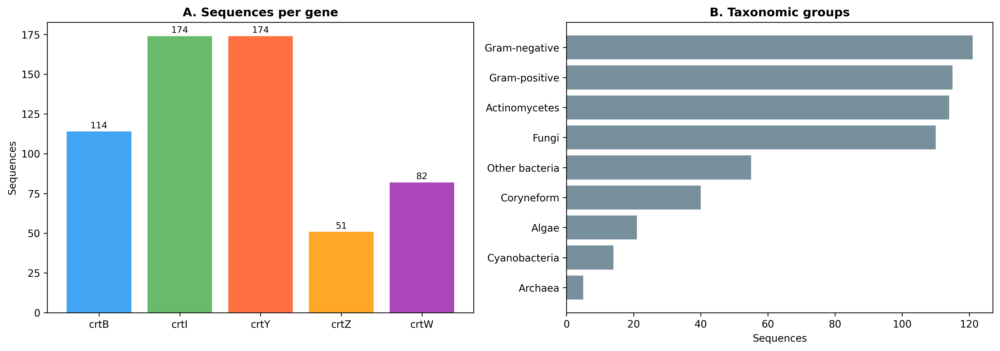
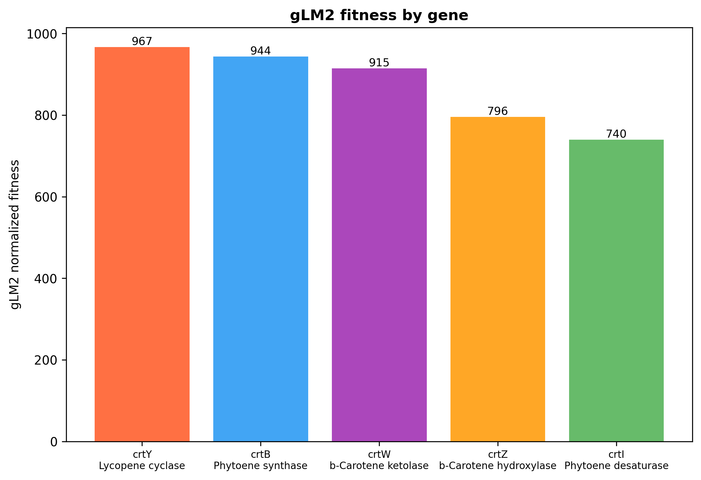
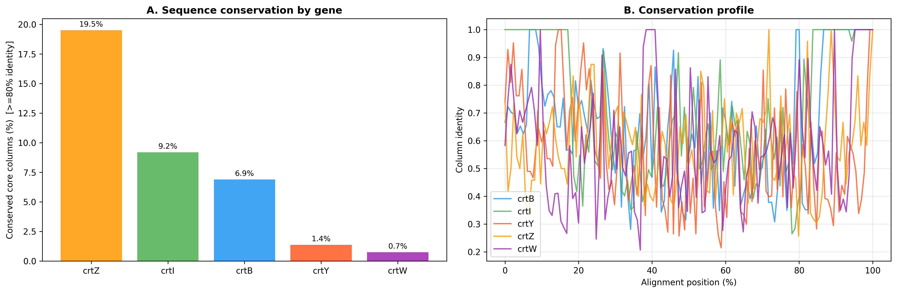
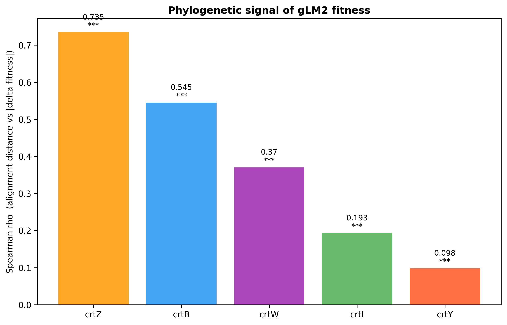
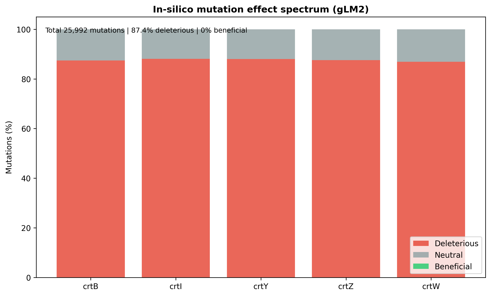

# 계통학·다중서열정렬과 유전체 언어모델(gLM2)을 활용한 미생물 카로티노이드 생합성 유전자의 적합도 진화 분석
 
## Evolution of Microbial Carotenoid Biosynthesis Gene Fitness via Phylogeny, Multiple Sequence Alignment, and a Genomic Language Model (gLM2)
 
---
 
## Abstract
 
카로티노이드는 미생물에서 항산화·광보호 기능을 담당하는 색소로, 그 생합성 유전자(crtB, crtI, crtY, crtZ, crtW)는 광범위한 분류군에 보존되어 있다. 본 연구는 9개 분류군 595개 단백질 서열을 대상으로, 유전체 언어모델 **gLM2**로 산출한 적합도(fitness) 대용치가 **계통학적 거리** 및 **다중서열정렬(MSA) 보존도**와 어떻게 연결되는지를 정량적으로 분석하여 카로티노이드 유전자의 적합도 진화 양상을 규명하였다. 그 결과 (1) gLM2 적합도는 crtY에서 가장 높고 crtI에서 가장 낮았으며, (2) FAMSA 다중서열정렬에서 보존 코어 컬럼 비율은 crtZ(19.5%)에서 가장 높고 crtW(0.7%)에서 가장 낮았다(평균 잔기 동일도는 crtI 0.715로 최고). (3) 핵심적으로, 계통학적 거리와 적합도 차이 간 상관(Spearman ρ)은 crtZ(0.735)와 crtB(0.545)에서 강하게(모두 p < 0.001) 나타나 **적합도가 계통을 따라 분기**함을 보였고, crtI·crtY에서는 약하였다. (4) in-silico 포화 돌연변이 분석에서 총 25,992개 치환 중 87.4%가 유해, 0%가 유익으로 분류되어 카로티노이드 효소들이 강한 정제선택(purifying selection) 하에 있음을 시사하였다. 본 연구는 언어모델 기반 적합도와 고전적 계통·정렬 분석을 결합하여 대사 경로 유전자의 진화적 제약을 평가하는 틀을 제시한다.
 
**Keywords:** carotenoid biosynthesis, evolutionary fitness, phylogenetic signal, multiple sequence alignment, genomic language model, gLM2, purifying selection
 
---
 
## 1. Introduction
 
카로티노이드(carotenoid)는 C40 isoprenoid 색소로, 미생물에서 활성산소 제거, 광보호, 막 안정화 등의 기능을 수행한다. 생합성 경로의 핵심 효소는 다음과 같다.
 
| 유전자 | 효소 | 반응 |
|--------|------|------|
| crtB | phytoene synthase | GGPP → 15-cis-phytoene |
| crtI | phytoene desaturase | phytoene → lycopene |
| crtY | lycopene cyclase | lycopene → β-carotene |
| crtZ | β-carotene hydroxylase | β-carotene → zeaxanthin |
| crtW | β-carotene ketolase | β-carotene → astaxanthin |
 
이 유전자들은 분류군 전반에 보존되어 있으나, 보존의 강도와 적합도 분포는 효소의 경로상 위치(분기점 여부, 기질 특이성)에 따라 다를 수 있다. 최근 유전체 언어모델(genomic language model)은 서열의 log-likelihood로 진화적 압력을 정량화하는 도구로 부상하였다. 본 연구에서는 TattaBio **gLM2**를 적합도 추정기로 사용하여, 카로티노이드 유전자의 적합도가 **계통학적 거리**와 **MSA 보존도**에 어떻게 대응되는지를 분석하였다.
 
본 연구의 질문은 다음과 같다.
 
1. 유전자별 gLM2 적합도와 MSA 보존도는 어떻게 다른가?
2. 서열이 진화적으로 멀어질수록 적합도 차이도 커지는가(적합도의 계통 신호)?
3. 카로티노이드 효소들은 어떤 선택압(정제/적응) 하에 있는가?
---
 
## 2. Materials and Methods
 
### 2.1 서열 수집
 
카로티노이드 생합성 유전자의 단백질 서열을 UniProt Knowledgebase에서 유전자별 단백질명 질의로 수집하였다. 식물은 제외하고 세균·방선균·시아노박테리아·곰팡이·조류·고균을 포함하였다. 최종적으로 595개 서열을 확보하였다(crtB 114, crtI 174, crtY 174, crtZ 51, crtW 82).
 
### 2.2 gLM2 기반 적합도 점수화
 
gLM2(`tattabio/gLM2_650M`)를 HuggingFace Transformers로 로드하여 각 단백질 서열의 pseudo-log-likelihood를 계산하고, 이를 적합도 대용치(`glm2_fitness`)로 사용하였다. 서열 길이 효과를 보정한 정규화 점수(`glm2_norm`)를 유전자·종 간 비교에 사용하였다.
 
### 2.3 다중서열정렬과 보존도
 
유전자별로 FAMSA(progressive multiple sequence aligner)로 다중서열정렬을 수행하였다. 각 정렬 컬럼에서 비-갭 잔기 중 가장 흔한 잔기의 비율을 동일도로 정의하고, 서열의 50% 이상이 비-갭인 컬럼을 코어(core) 컬럼으로 보았다. 코어 컬럼 중 동일도 ≥80%인 컬럼을 보존 컬럼으로 분류하여 그 비율을 산출하였다.
 
### 2.4 계통학적 거리와 계통 신호
 
정렬된 서열 쌍에 대해 정규화 거리(1 − 동일 잔기 비율)를 계산하여 거리 행렬을 구성하였다. 적합도의 **계통 신호**는 모든 서열 쌍의 (정렬 거리, |gLM2 적합도 차이|)에 대한 Spearman 상관(ρ)으로 평가하였다 — ρ가 양수이고 클수록 적합도가 계통학적 분기를 따라 변함을 의미한다.
 
### 2.5 In-silico 돌연변이 효과
 
각 서열의 모든 위치에서 가능한 아미노산 치환에 대해 gLM2 점수 변화를 계산하고, 점수 감소(유해)·무변화(중립)·증가(유익)로 분류하여 유전자별 돌연변이 스펙트럼을 산출하였다.
 
### 2.6 재현성
 
`src/analysis.py` 한 번의 실행으로 본 보고서의 모든 수치(보존도·계통신호·적합도)와 그림(Fig 1–5)이 `data/`의 committed 파일로부터 재생성된다.
 
---
 
## 3. Results
 
### 3.1 데이터셋 개요
 
595개 서열은 9개 분류군에 분포하였으며(그람음성균 121, 그람양성균 115, 방선균 114, 곰팡이 110, 기타 세균 55, 코리네형 40, 조류 21, 시아노박테리아 14, 고균 5), 유전자별로는 crtI·crtY가 각 174개로 가장 많고 crtZ가 51개로 가장 적었다 
.
 
### 3.2 유전자별 gLM2 적합도
 
정규화 gLM2 적합도는 다음 순으로 나타났다 .
 
| 유전자 | gLM2 정규화 적합도 | 원점수(평균) | n |
|--------|--------------------|--------------|---|
| crtY | 967 | 695.9 | 174 |
| crtB | 944 | 681.1 | 114 |
| crtW | 915 | 666.5 | 82 |
| crtZ | 796 | 603.5 | 51 |
| crtI | 740 | 579.7 | 174 |
 
경로 분기점 효소인 crtY(lycopene cyclase)가 가장 높은 적합도를, 긴 기질을 다루는 crtI(phytoene desaturase)가 가장 낮은 적합도를 보였다.
 
### 3.3 MSA 보존도
 
보존 코어 컬럼(동일도 ≥80%)의 비율은 crtZ에서 가장 높았고, 평균 잔기 동일도는 crtI에서 가장 높았다 .
 
| 유전자 | 정렬 길이 | 코어 컬럼 | 보존 코어 (≥80%) | 평균 잔기 동일도 |
|--------|-----------|-----------|------------------|------------------|
| crtZ | 745 | 164 | 19.5% | 0.584 |
| crtI | 1479 | 501 | 9.2% | 0.715 |
| crtB | 1085 | 305 | 6.9% | 0.667 |
| crtY | 918 | 367 | 1.4% | 0.559 |
| crtW | 1003 | 270 | 0.7% | 0.587 |
 
작고 기능이 특화된 crtZ는 보존 코어 컬럼 비율이 가장 높았고(강한 국소 보존), crtI는 가장 긴 정렬에서 전반적 동일도가 가장 높았다. 반면 crtW·crtY는 강하게 보존된 코어 위치가 적었다.
 
### 3.4 적합도의 계통 신호 (핵심 결과)
 
정렬 거리와 |gLM2 적합도 차이| 간 Spearman 상관은 유전자에 따라 뚜렷이 갈렸다 .
 
| 유전자 | Spearman ρ | p-value | 쌍 수 |
|--------|------------|---------|-------|
| crtZ | **0.735** | < 0.001 | 1,275 |
| crtB | **0.545** | < 0.001 | 6,441 |
| crtW | 0.370 | < 0.001 | 3,321 |
| crtI | 0.193 | < 0.001 | 15,051 |
| crtY | 0.098 | < 0.001 | 15,051 |
 
crtZ와 crtB에서는 서열이 진화적으로 멀어질수록 적합도 차이도 크게 증가하여 **적합도에 강한 계통 신호**가 존재하였다(ρ=0.74, 0.55). 즉 이 유전자들에서는 서열 분기가 적합도 변화로 직접 이어진다. crtW는 중간 정도(ρ=0.37)였고, crtI·crtY에서는 상관이 약해(ρ=0.19, 0.10) 계통학적 거리와 비교적 무관하게 적합도가 유지되었다(분류군 전반의 균일한 기능적 제약).
 
### 3.5 돌연변이 효과 스펙트럼
 
in-silico 포화 치환 분석에서 총 25,992개 치환 중 22,716개(87.4%)가 유해, 3,276개(12.6%)가 중립, **유익은 0개(0%)**로 분류되었다 . 유전자별 유익 돌연변이율은 모두 0%였다.
 
| 유전자 | 총 치환 | 유해 | 중립 | 유익 |
|--------|---------|------|------|------|
| crtB | 7,942 | 6,944 | 998 | 0 |
| crtZ | 7,296 | 6,391 | 905 | 0 |
| crtW | 7,847 | 6,821 | 1,026 | 0 |
| crtY | 1,653 | 1,455 | 198 | 0 |
| crtI | 1,254 | 1,105 | 149 | 0 |
 
이는 카로티노이드 효소들이 이미 적합도 지형의 국소 최적점 부근에 위치하여, 무작위 치환 대부분이 적합도를 떨어뜨리는 **강한 정제선택** 상태임을 시사한다.
 
---
 
## 4. Discussion
 
### 4.1 적합도·보존도·계통 신호의 종합
 
세 지표는 서로 다른 진화적 측면을 포착한다. crtZ는 **가장 높은 보존 코어 비율(19.5%)과 가장 강한 계통 신호(ρ=0.74)**를 동시에 보여, 핵심 위치가 강하게 보존되면서 남은 변이가 계통을 따라 적합도로 반영되는 전형적 정제선택 패턴을 나타낸다. crtB는 **상대적으로 낮은 보존 코어 비율(6.9%)에도 강한 계통 신호(ρ=0.55)**를 보이는데, 이는 분류군별로 서열은 크게 다르지만 그 차이가 적합도 차이로 일관되게 이어짐을 의미한다(분류군 특이적 적응 또는 계통별 최적화). 반대로 crtI는 평균 동일도가 가장 높으면서도(0.715) 계통 신호는 약하여(ρ=0.19), 광범위한 서열 배경에서 기능이 균일하게 유지되는 강건한 효소로 해석된다. crtY도 유사하게 거리와 약하게만 연동되었다(ρ=0.10).
 
### 4.2 정제선택의 증거
 
모든 유전자에서 유익 돌연변이가 0%인 점은 카로티노이드 경로가 진화적으로 잘 최적화되어 있음을 강하게 시사한다. 이는 카로티노이드가 다수 미생물의 생존·스트레스 내성에 기여하는 필수에 가까운 기능을 담당한다는 생물학적 배경과 부합한다.
 
### 4.3 한계 및 향후 과제
 
1. **계통 추정의 정밀도**: 본 연구는 FAMSA 정식 다중서열정렬과 정렬 거리 기반 분석을 사용하였다. 향후 최대우도(ML) 계통수(IQ-TREE 등)와 Blomberg's K·Pagel's λ 등 정식 계통신호 지표로 확장하면 신뢰도가 더 향상된다.
2. **적합도의 실험적 검증**: gLM2 점수는 계산적 대용치이며, 부위특이적 돌연변이·활성 측정으로 검증이 필요하다.
3. **모델 의존성**: 단일 언어모델(gLM2)에 기반하므로, 다른 모델과의 교차검증으로 일반성을 확인할 수 있다.
4. **종 표본의 편향**: UniProt 등록 편향으로 일부 분류군이 과대표집될 수 있다.
---
 
## 5. Conclusion
 
gLM2 적합도와 계통·정렬 분석을 결합하여, 카로티노이드 생합성 유전자의 적합도 진화를 정량화하였다. crtB·crtZ에서 적합도가 계통학적 거리를 강하게 따라가는 반면 crtI·crtY·crtW는 그렇지 않았고, 전 유전자에서 유익 돌연변이가 부재하여 강한 정제선택이 확인되었다. 본 틀은 다른 대사 경로의 진화적 제약 분석에도 확장 적용될 수 있다.
 
---
 
## Figure Legends
 
- **Fig. 1.** 데이터셋 개요 — (A) 유전자별 서열 수, (B) 분류군 분포.
- **Fig. 2.** 유전자별 gLM2 정규화 적합도.
- **Fig. 3.** MSA 보존도 — (A) 유전자별 보존 코어 컬럼 비율, (B) 정렬 위치별 잔기 동일도 프로파일.
- **Fig. 4.** 적합도의 계통 신호 — 정렬 거리와 |Δ적합도| 간 Spearman ρ (\*\*\* p<0.001).
- **Fig. 5.** in-silico 돌연변이 효과 스펙트럼(유해/중립/유익).
---
 
*Date: 2026-06-12 · Korea University, IBT619*
