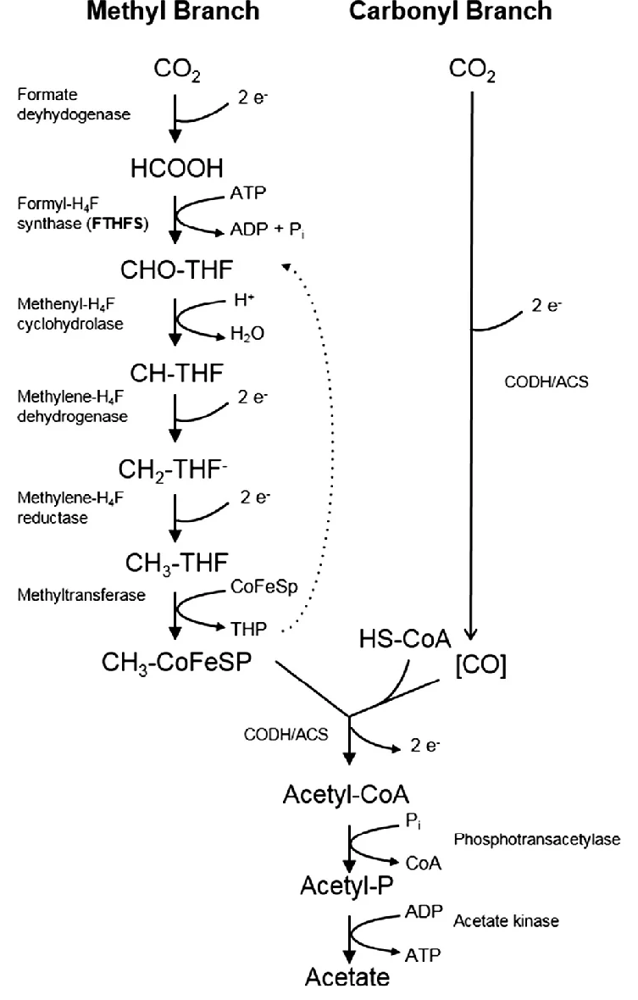
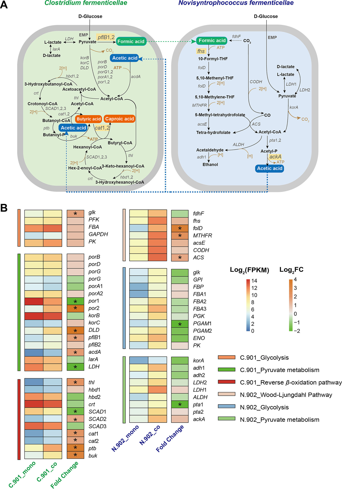
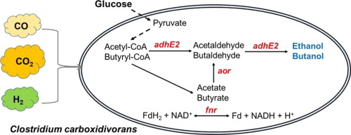

 # Term Project Plan
***

## 1. Bottlenecks in my study

 ### Goal
- Producing high value added chemicals using CO2 as a substrate through anaerobic microorganisms (clostridium)
- ex. **hexanol** or long chain fatty acid and alcohol
 ### Background
- Wood-ljungdahl pathway [1] 
 

- chain elongation pathway (reverse beta oxidation) [2] 
 

- acid and alcohol production pathway [3] 
 

 ### Bottlenecks
- The genomes of Clostridium strains contain a large number of **hypothetical proteins**. Some of these may be part of the **chain elongation pathway** or the **Wood-Ijungdahl pathway**, which fixes CO2.
- No positive effects were observed due to the overexpression of native genes. There will be limitations as native genes were identified solely based on **sequence similarity information**. 
- Additionally, it is expected that there will be carbon-specific genes.    
(There are three chain elongation clusters in the Clostridium genome currently under study.)

## 2. Computational strategies (using genomic language model)

#### [gLM Github code]( https://github.com/y-hwang/gLM) [4]
### Strategy 1
> Aim : Searching the function of "hypothetical protein" 
- step 1 : checking if the model works well using already annotated gene clusters (ex. crt-hbd-etfBA)
- step 2 : preparation of my contig file (10-15 genes with direction information +, -)
- step 3 : preparation of reference set (functionally similar genes)
- step 4 : getting embedding values ​​through **gLM inference** 
- step 5 : checking function through distance comparison

### Strategy 2
> Aim : Cross validation with "RNA-seq"
- step 1 : checking if the model works well using already annotated gene clusters (ex. crt-hbd-etfBA)
- step 2 : preparation of my contig file (annotated gene clusters, 10-15 genes with direction information +, -)
- step 3 : preparation of reference set (functionally similar genes)
- step 4 : getting embedding values ​​through **gLM inference** 
- step 5 : checking function through distance comparison

### Strategy 3
> Aim : Identifying candidates for alcohol production enzymes    
 (Sequence similarity can be missed)
- step 1 : checking if the model works well using already annotated gene clusters (ex. crt-hbd-etfBA)
- step 2 : preparation of my contig file (adhE2 and aor, 10-15 genes with direction information +, -)
- step 3 : preparation of reference set (functionally similar genes)
- step 4 : getting embedding values ​​through **gLM inference** 
- step 5 : checking function through distance comparison

## 3. Expected results
### Results of each strategy
- Verification the function of some hypothetical proteins. Checking if it is similar to RNA sequencing results.
### limitations
- Genomic language model training will be difficult due to the laptop's insufficient GPU specifications.
- It seems difficult to determine the substrate specificity of genes using gLM models. There might be methods such as predicting the structure using Alphafold or docking each substrate.

## 4. Reference
- [1] : [Biogas production through syntrophic acetate oxidation and deliberate operating strategies for improved digester performance](https://www.sciencedirect.com/science/article/pii/S0306261916308364?via%3Dihub)
- [2] : [Metabolite-Based Mutualistic Interaction between Two Novel Clostridial Species from Pit Mud Enhances Butyrate and Caproate Production](https://journals.asm.org/doi/10.1128/aem.00484-22)
- [3] : [Metabolic engineering of Clostridium carboxidivorans for enhanced ethanol and butanol production from syngas and glucose](https://www.sciencedirect.com/science/article/pii/S096085241930519X?via%3Dihub)
- [4] : [Genomic language model predicts protein co-regulation and function](https://www.nature.com/articles/s41467-024-46947-9)

