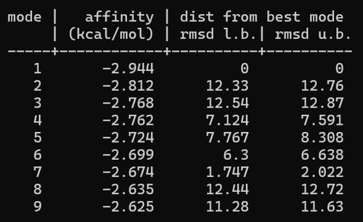
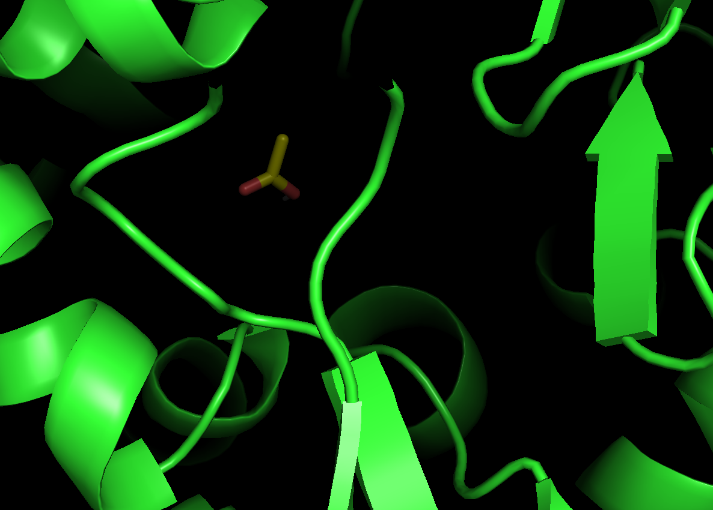
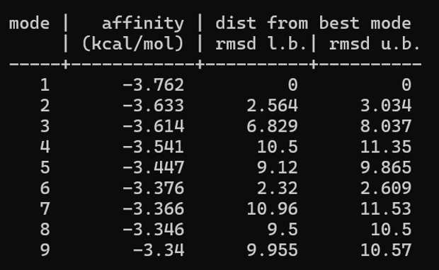
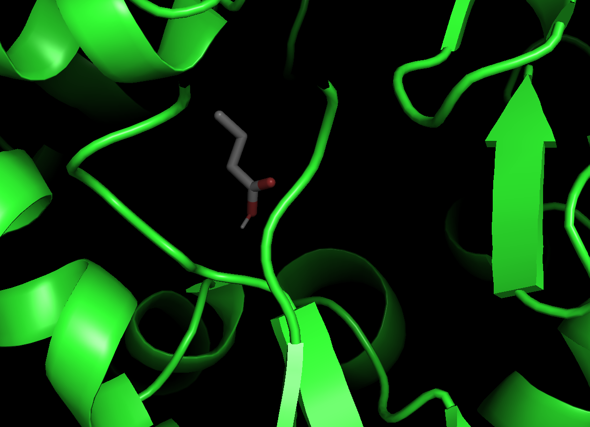
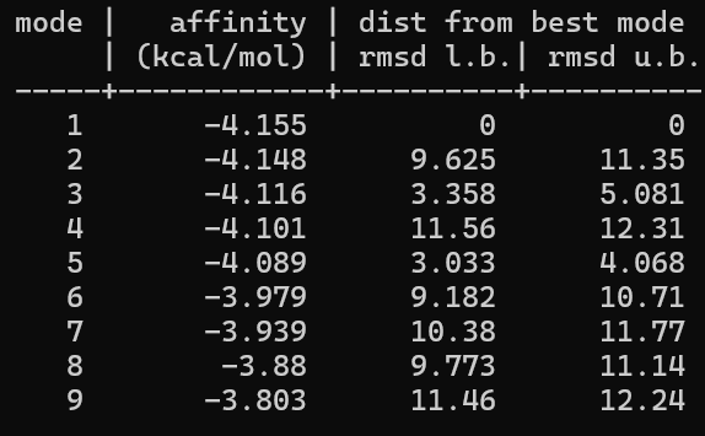
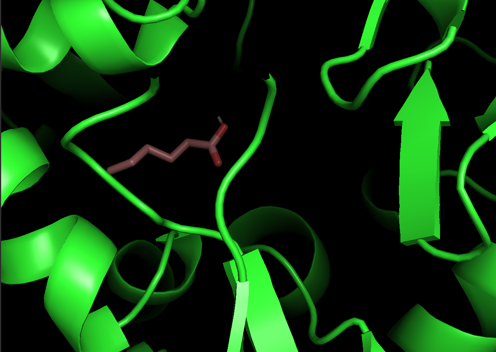
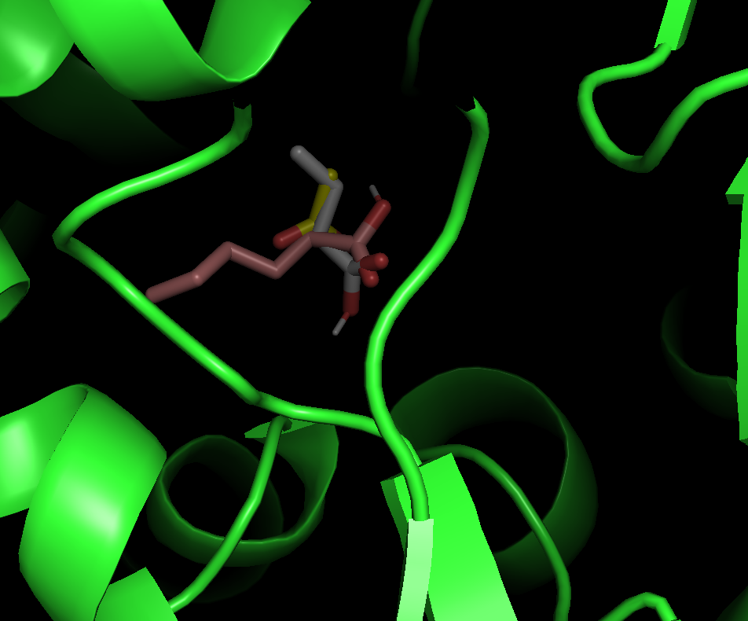

 # Term Project : Genomic language model을 사용해서 Clostridium의 unknown protein의 function 및 alcohol production에 관여하는 enzyme의 chain specific 예측
***
## Seminar (ysoh-0514)
- Seminar: [**Shedding light on functional dark matter with genomic language modeling**](https://youtu.be/G01tGkcw-OA?si=lvekBZHEcXCBApY8)  
- Paper: [Genomic language model predicts protein co-regulation and function](https://www.nature.com/articles/s41467-024-46947-9)
- In class: [presentation](https://docs.google.com/presentation/d/1sF-S-429DUhPfFoTV15OXIbcB2kLGqsV/edit?usp=sharing&ouid=107177185030271497727&rtpof=true&sd=true)
***
## Overview
<pre><code>
[gLM]
1. 원하는 부분의 gene contig file을 준비한다.   
   (15 - 30개 / seminar에서는 30개로 training 시킴)
2. Colab 또는 Anaconda를 통해 환경 설정을 해준 뒤, data를 input한다.
3. embedding 값을 얻고 이를 inference하여 수치화시킨다.
4. target하는 gene과 주변 gene의 거리를 통해 기능적으로 유사할지 예측한다.

[Docking simulation]
1. target하는 gene를 Alphafold2를 사용해서 structure를 얻는다.
2. 해당 gene과 아미노산 서열 유사도가 높은 reference gene을 selection하여 보조인자의 위치를 확인할 수 있게 한다.
3. Anaconda에서 receptor와 ligand를 지정하고, vina를 통해 docking affinity를 확인한다.
4. affinity를 PyMOL에서 시각화하여 active site에 붙는지 확인한다. 

</code></pre>

## 1. gLM 구동
### 1-1. Input data 생성
<pre><code>2가지의 contig file 생성

1. sequence fasta file (.fa) : target하는 gene 앞 뒤로 7개의 gene (total 15개)

2. sequence direction file (.tsv) : 각 gene의 방향을 +, -로 설정
ex) contig_00114	+RS13210;+RS13215;+RS13220;+RS13225--- 
</code></pre>
- contig_00114 입력 후 'tab'으로 구분해준다.
- direction file 생성할 때, 마지막 gene 뒤에는 ; 을 붙이지 않는다. 
- fasta file과 direction file의 gene name이 동일한지 확인한다.
### 1-2. Environment 설정 (Google colab)
<pre><code>
!nvidia-smi
!git clone https://github.com/y-hwang/gLM 
!pip install fair-esm fairscale -q
print("=== 설치 완료 ===")

-------------------------------------------

# colab에 맞는 transformation 호환

path = '/content/gLM/gLM/gLM.py'
with open(path) as f:
    code = f.read()
code = code.replace(
    'self.update_keys_to_ignore(config, ["lm_head.decoder.weight"])',
    '# self.update_keys_to_ignore(config, ["lm_head.decoder.weight"])  # 호환성 수정'
)
with open(path, 'w') as f:
    f.write(code)
print("=== gLM.py 수정 완료 ===")

-------------------------------------------

# download 하는데 30 m 소요

!mkdir -p /content/gLM/model
!wget -q -O /content/gLM/model/glm.bin https://zenodo.org/record/7855545/files/glm.bin
!ls -lh /content/gLM/model/glm.bin

</code></pre>
- linux 또는 Anaconda로 사용하는 방법이 불필요한 errors를 줄일 수 있다.   
 (data download의 소요 시간이 bottleneck이어서 colab으로 사용했음)

### 1-3. Data input
<pre><code>
from google.colab import files
print("my_gene_00114.fa 와 my_contig_00114.tsv 두 파일을 선택하세요")
uploaded = files.upload()

</code></pre>

- step 1-1에서 생성한 fa, tsv 파일을 업로드 한다.

### 1-3. Embedding 값 출력
<pre><code>
%cd /content/gLM/data
!mkdir -p my_batched_data
!python batch_data.py my_gene_00114.esm.embs.pkl my_contig_00114.tsv my_batched_data
!ls my_batched_data

</code></pre>
- 3번째 줄을 보면 file name이 있어 코드를 사용할 때 file name이 일치하는지 확인한.

## 2. Chain specific 예측
>gLM만으로 chain specific을 예측하기 어려움.   
 따라서 Alphafold2로 structure를 예측한 다음, vina 및 PyMOL를 사용하여 C6 acid를 docking 해보고자 함.

### 2-1. Reference gene 

- target gene은 Protein Data Bank(PDB)에 data가 없기 때문에 Alphafold2로 structure를 예측해야한다. 그러나 Alphafold2를 통해 W 또는 Mo와 같은 보조인자는 알 수 없기 때문에 해당 gene과 amino acid similiarity가 높은 _Clostridium autoethanogenum_ 의 sequence를 reference로 사용한다.
- PDB에서 reference sequence를 다운로드 받는다. (PDBx/mmCIF Format , .cif 형식)

### 2-2. Target gene Structure 준비 (Alphafold2)
- google colab에서 'ColabFold AlphaFold2_mmseqs2'을 검색하여 Alphafold2 실행
- 'query_sequence' 칸에 target하는 amino acid sequence 붙여넣기
- .pdb 파일이 자동 다운로드되면 성공

### 2-3. Docking 환경 구축 
<pre><code>
# 도킹 전용 환경 만들기
conda create -n docking python=3.9 -y
conda activate docking

# 핵심 도구
conda install -c conda-forge openbabel -y      # 리간드 3D 변환
pip install meeko                              # vina용 파일 준비

</code></pre>
- AutoDock Vina: https://github.com/ccsb-scripps/AutoDock-Vina/releases 에서 실행파일 받기
- PyMOL :  https://pymol.org 에서 다운로드

### 2-4. Receptor 준비
- PyMOL에서 진행한다.
  - solvent 제거
  - h added
- 해당 파일을 .pdb로 저장 → 00114.pdb
- Vina용 형식(.pdbqt)으로 변환
<Pre><code>prepare_receptor -r aor.pdb -o aor.pdbqt</code></Pre>

### 2-5. Ligand 준비
<pre><code>
# acetic acid
obabel -:"CC(=O)O" -O acetic_acid.pdbqt --gen3d

# butyric acid
obabel -:"CCCC(=O)O" -O butanoic_acid.pdbqt --gen3d

# hexanoic acid
obabel -:"CCCCCC(=O)O" -O hexanoic_acid.pdbqt --gen3d

</code></pre>

- 더 긴 사슬을 넣어서 어디부터 docking이 안되는지 확인할 수 있다.

<pre><code>
# acetic acid
vina.exe --receptor aor.pdbqt --ligand acetic_acid.pdbqt --center_x 16.772 --center_y 26.895 --center_z 24.908 --size_x 22 --size_y 22 --size_z 22 --exhaustiveness 16 --out acetic_out.pdbqt > acetic_log.txt
type acetic_log.txt

# butyric acid
vina.exe --receptor aor.pdbqt --ligand butanoic_acid.pdbqt --center_x 16.772 --center_y 26.895 --center_z 24.908 --size_x 22 --size_y 22 --size_z 22 --exhaustiveness 16 --out butanoic_out.pdbqt > butanoic_log.txt
type butanoic_log.txt

# hexanoic acid
vina.exe --receptor aor.pdbqt --ligand hexanoic_acid.pdbqt --center_x 16.772 --center_y 26.895 --center_z 24.908 --size_x 22 --size_y 22 --size_z 22 --exhaustiveness 16 --out hexanoic_out.pdbqt > hexanoic_log.txt
type hexanoic_log.txt

</code></pre>
- 각 chain 별로 affinity 값을 얻을 수 있고, PyMOL에서 구조를 시각화하여 ligand가 어디에 붙는지 확인한다.
<pre><code>load C:/docking/acetic_out.pdbqt, c2pose
load C:/docking/hexanoic_out.pdbqt, c6pose
show spheres, ref and elem W
color orange, ref and elem W
show sticks, c2pose
show sticks, c6pose
zoom ref and elem W, 15</code></pre>

## 3. Result
### 3-1. gLM 
#### 3-1-1. strategy 1) Hypothetical protein
> RNA sequencing을 바탕으로 특이적으로 발현량이 높거나 낮은 hypothetical protein을 선별함.    
cluster 안에 여러 개의 hypothetical protein이 존재하는 경우 및 hypothetical protein 수가 많아서 각 경우 별로 1가지의 예시만 올렸음.

| Gene number | Cosine similarity | Euclidean distance | 
| ----- | ----- | ----- | 
| 1 | 0.999929 | 0.100 | 
| 2 | 0.999808| 0.170 | 
| 3 | 0.999722 | 0.199 |
| 4 | 0.992781 | 0.982|
| 5 | 0.995628 | 0.775|

- target gene는 1, 2, 3과 같은 genomic context 또는 functional/regulatory module에 속할 가능성이 높다.

#### 3-1-2. strategy 2) Aldehyde ferredoxin oxidoreductase
> 주변 genomic context 정보를 가지고 해당 gene의 기질 특이성을 확인하고자 했음.

| Gene number | Cosine similarity | Euclidean distance | 
| ----- | ----- | ----- | 
| 1 | 0.999160 | 0.343961 | 
| 2 | 0.998589| 0.447579 | 
| 3 | 0.997954 | 0.537559 |
| 4 | 0.988968 | 1.254940|
| 5 | 0.554476 | 9.787482|

- 4, 5은 aor와 같은 functional/regulatory module보다는 다른 기능적 맥락에 있는 유전자일 가능성이 높다.
- molybdenum/tungsten cofactor biosynthesis 또는 sulfur-carrier system과 연결된 redox gene cluster 안에 위치하며, 주변 조절 유전자 및 cofactor-related 유전자들과 같은 functional/regulatory module에 속할 가능성이 높다.   
(gene number는 밝히기 어렵습니다.)
### 3-2. Docking simulation
- acetic acid affinity

- butyric acid affinity

- hexanoic acid affinity

- C2, C4, C6가 active site에 docking 된다. chain이 증가하면서 affinity도 증가하는 것을 확인하여 simulation이 잘 이루어졌다. 
- hexanoic acid도 docking 되면서 affinity가 증가하는 것으로 보아 C6에도 working 할 것으로 예상한다. 
- octanoic acid도 docking 되는 결과가 있어 어떤 carbon chain 1개의 특이성을 갖는 enzyme은 아닐 수도 있다는 결론이다.

## 4. Conclusion & Discussion
### Conclusion
- **gLM**은 genomic context 기반의 embedding(cosine similarity, Euclidean distance)을 통해 target gene이 어떤 functional/regulatory module에 속하는지 예측하는 데 효과적이었다.
  - Hypothetical protein은 cosine similarity가 0.999 이상으로 매우 높은 gene들과 같은 module에 속할 가능성이 높았다.
  - Aldehyde ferredoxin oxidoreductase(AOR)는 molybdenum/tungsten cofactor biosynthesis 및 sulfur-carrier system과 연결된 redox gene cluster 안에 위치하는 것으로 예측되었다.
- 다만 **gLM 단독으로는 chain specificity(기질의 탄소 사슬 길이 특이성)를 예측할 수 없었다.** 이는 gLM이 '주변 유전자 맥락'을 보는 모델이지, 효소-기질 결합을 직접 다루는 모델이 아니기 때문이다.
- 이를 보완하기 위해 **AlphaFold2 structure 예측 + AutoDock Vina docking + PyMOL 시각화** 파이프라인을 적용한 결과:
  - C2(acetic), C4(butyric), C6(hexanoic) acid가 모두 active site(W cofactor 근처)에 docking 되었다.
  - 사슬이 길어질수록 binding affinity가 증가하는 경향을 보였고, 이는 docking simulation이 합리적으로 작동했음을 시사한다.
- 종합하면, 이 효소는 **단일 탄소 사슬 길이에 특이적이라기보다 비교적 넓은 범위의 기질을 받아들일 가능성이 높다.**

### Discussion
- **Affinity 증가 경향의 해석에는 주의가 필요하다.** Docking affinity는 사슬이 길어질수록 (원자 수가 많아져 van der Waals 접촉이 늘어나면서) 일반적으로 높아지는 경향이 있다. 따라서 affinity 증가 자체가 곧바로 '생물학적 기질 특이성'을 의미하지는 않으며, 어디까지를 실제 기질로 볼지는 추가 실험적 검증이 필요하다.
- **Octanoic acid(C8)까지 docking 되는 결과**는, 이 효소가 특정 사슬 길이 하나에만 작동하는 specific enzyme이 아니라 broad-specificity enzyme 일 가능성을 뒷받침한다.
- **Method의 한계**
  - AlphaFold2는 W/Mo 같은 보조인자(cofactor)를 예측하지 못해, _C. autoethanogenum_ reference sequence로 cofactor 위치를 보완해야 했다. 이 reference 의존성은 예측 정확도에 영향을 줄 수 있다.
  - Docking은 단백질을 rigid body로 가정하는 경우가 많아, 실제 효소의 conformational change나 induced fit을 반영하지 못한다.
- **Future direction**
  - gLM이 예측한 cofactor cluster 가설을 sequence motif 분석이나 실험적 검증(activity assay)으로 확인할 수 있다.
  - 실제 효소 활성 측정(in vitro enzyme assay)을 통해 각 사슬 길이별 kinetics(Km, kcat)를 비교하여 docking 예측과 대조해 볼 수있다.
  

